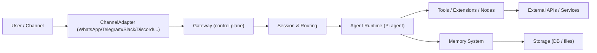

## Alii / OpenClaw – Architecture Overview

This repository vendors **OpenClaw**, a multi‑channel, local‑first AI gateway. It acts as the **control plane** for your personal assistant and companion apps (macOS, iOS, Android).

At a high level:

- Real‑world channels (WhatsApp, Telegram, Slack, Discord, Signal, iMessage, etc.) connect into the **Gateway**.
- The Gateway manages **sessions, agents, tools, media, and scheduling**.
- Companion apps (macOS menu bar app, iOS/Android nodes, web UI/TUI) talk to the Gateway over WebSocket/HTTP and the CLI.

---

## 1. Entry Points & Runtime Surface

- **Global CLI binary**: `openclaw` (from `openclaw.mjs` in `package.json` `bin`).
  - Installed via `npm install -g openclaw` or running from source with `pnpm`.
- **TypeScript entry shim**: `src/entry.ts`
  - Normalizes environment (warnings, CLI profiles, Windows argv).
  - Respawns Node with `--disable-warning=ExperimentalWarning` if needed.
  - Delegates to `./cli/run-main.js` which wires up the actual CLI.
- **CLI program**: `src/index.ts`
  - Builds the Commander CLI (`buildProgram`) with commands like:
    - `openclaw onboard` – onboarding wizard.
    - `openclaw gateway` – start Gateway server.
    - `openclaw agent` – talk to an agent directly.
    - `openclaw message send` – send one‑off messages.
  - Sets up logging, runtime guard, process error handlers.

**Dev loop from source** (from `README.md` and `package.json`):

```bash
pnpm install
pnpm ui:build        # build web/control UI
pnpm build           # build TypeScript → dist

pnpm openclaw onboard --install-daemon
pnpm gateway:watch   # auto‑reload Gateway on TS changes
```

---

## 2. Core Subsystems in `src/`

The `src/` tree is organized around clear subsystems:

- `gateway/` – Gateway server, WebSocket/HTTP endpoints, control plane.
- `channels/` + per‑channel dirs (`telegram/`, `slack/`, `discord/`, `signal/`, `whatsapp/`, `line/`, `imessage/`, etc.) – protocol adapters that translate provider‑specific events into a common event model.
- `agents/` – agent routing, Pi agent RPC integration, tools, and session behaviors.
- `memory/` – storage and retrieval of conversations and system state.
- `media/`, `media-understanding/` – media pipeline for images/audio/video, including parsing, MIME handling, and hosting.
- `cron/` – job scheduling, wakeups, and long‑running background jobs.
- `config/` – config loading/validation, sessions, profiles, and per‑channel overrides.
- `infra/` – environment normalization, ports, binaries, runtime guards, etc.
- `logging/` – structured logging and console capture.
- `process/` – child‑process bridge, exec helpers, lanes/queues.
- `tui/`, `web/`, `browser/`, `canvas-host/` – terminal UI, web control UI, browser tooling, and Canvas/A2UI host.
- `daemon/` – OS‑level service integration (launchd, systemd, schtasks) for running the Gateway as a background service.

These modules are designed to be **composable and testable**, with extensive Vitest and Playwright coverage.

---

## 3. Request Flow: Channels → Gateway → Agents → Tools

Conceptually, a message flows like this:



**Step‑by‑step:**

1. **Channel adapters** receive events from providers:
   - E.g. Telegram via grammY, Slack via Bolt, WhatsApp via Baileys, Signal via signal‑cli, etc.
2. Each adapter normalizes messages into a **common event shape** and hands them to the Gateway.
3. The **Gateway** (in `src/gateway/`) performs:
   - Session lookup/creation (`sessions/`).
   - Routing based on channel, group, user, and config (`config/`, `routing/`).
   - Enforcement of DM policies, allowlists, and safety/limits.
4. The **Agent runtime** uses the Pi agent libraries and model providers to:
   - Decide which tools to invoke (browser, canvas, cron, nodes, custom skills).
   - Stream responses back to the Gateway (tool streaming + block streaming).
5. **Tools and extensions** run actions:
   - Browser automation, Canvas/A2UI operations, nodes (camera, audio, location), cron jobs, webhooks, Gmail Pub/Sub, workspace skills, etc.
6. **Memory** is updated:
   - Conversations are captured and pruned.
   - Long‑term state is stored for future sessions (depending on config).

---

## 4. Companion Surfaces (Apps, Web, TUI)

Several “faces” sit on top of the Gateway:

- **Web UI / Control plane** (`src/web/`):
  - Serves the Control UI and WebChat directly from the Gateway.
  - Provides configuration, monitoring, and inbox views.
- **TUI** (`src/tui/`):
  - Terminal user interface for controlling agents and monitoring state.
  - Run via `pnpm tui` or `pnpm tui:dev` during development.
- **Canvas host** (`src/canvas-host/`):
  - Hosts the Canvas / A2UI surface for visual interaction.
  - Integrated with macOS/iOS/Android nodes.
- **Companion apps** (`apps/macos`, `apps/ios`, `apps/android`):
  - macOS menu bar app and mobile nodes used for Voice Wake, Talk Mode, Canvas, camera, and screen capture.
  - Communicate with the Gateway over the same protocol and WebSocket/HTTP surfaces.

All of these surfaces share the **same Gateway** as their backend and benefit from the same routing, memory, and tools.

---

## 5. Configuration, Models, and Providers

Configuration is driven by:

- Files under `src/config/` and docs at `docs/` / `docs.openclaw.ai`.
- Environment variables loaded via `src/infra/dotenv.ts` and `normalizeEnv`.
- Model configuration and failover policies (Anthropic, OpenAI, local models, etc.).

Key points:

- **Models** and auth (OAuth vs API keys) are described in the external docs; this repo implements the runtime wiring and fallbacks.
- **Sessions** can be configured per‑channel and per‑peer (e.g. DM pairing policies, group routing, isolation).
- **Profiles** allow switching between dev/prod or different auth/model stacks via CLI flags and env.

---

## 6. Development & Testing

Useful scripts in `package.json`:

- **Build & run from source**
  - `pnpm install`
  - `pnpm ui:build`
  - `pnpm build`
  - `pnpm openclaw onboard --install-daemon`
  - `pnpm gateway:watch` (auto‑reload Gateway)
- **Testing**
  - `pnpm test` – unit tests (Vitest).
  - `pnpm test:e2e` – end‑to‑end tests.
  - `pnpm test:live` – live integration tests (models + channels; requires credentials).
  - `pnpm test:docker:all` – Docker‑based tests (onboard, gateway, QR, plugins, etc.).
- **Linting & formatting**
  - `pnpm check` – typecheck + lint + formatting check.
  - `pnpm lint`, `pnpm lint:fix`, `pnpm format`.

---

## 7. Mental Model Summary

When working in this repo, keep this picture in mind:

- **Gateway** is the **hub**: all channels, agents, tools, and apps flow through it.
- **Channels** adapt external messaging surfaces into a unified event stream.
- **Agents** (via Pi agent runtime) implement reasoning and tool orchestration.
- **Tools & nodes** give agents capabilities (browser, Canvas, file/system access, cron, nodes).
- **Memory & sessions** provide continuity and safety across interactions.

Most changes you’ll make fall into one of three buckets:

1. **Channel work** – adding or tweaking an integration under `src/channels/` or a per‑channel directory.
2. **Gateway/agent behavior** – routing, session policy, or agent/tool logic.
3. **Surfaces** – UI/TUI/web/canvas or companion apps that sit on top of the same Gateway.

